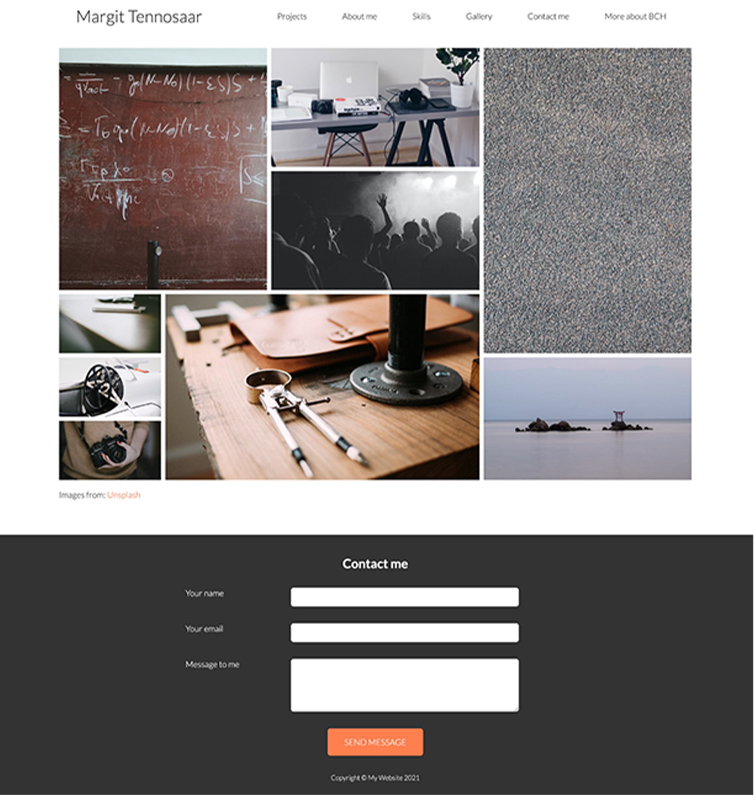

# Portfolio project

This was my first school project, with the main focus on practicing skills with **HTML5** and **CSS3**. The objective was to create a personal portfolio website, built to closely match example pages (screenshots attached). While the overall structure was guided, I had the freedom to choose my own images and colors.

## Project overview

The purpose of this portfolio page is to provide a clean, responsive, and visually appealing layout that showcases the use of various HTML and CSS techniques. During this project, I specifically worked on the following skills:

- **HTML5 structure**: Basic page structure, including headings, paragraphs, images, and links.
- **CSS flexbox**: Creating flexible layouts for different devices, aligning and wrapping elements.
- **CSS grid**: Building more complex layouts using grid-based methods.
- **Responsive design**: Utilizing media queries to ensure the page scales properly for different screen sizes (mobile, tablet, desktop).
- **Navigation menus**: Designing a simple, responsive navigation bar with dropdown functionality.
- **Animations and transitions**: Adding basic CSS animations and hover effects, such as sliding transitions and interactive buttons.
- **Fonts and icons**: Integrating various web fonts and icons, such as Google Fonts and Font Awesome.
- **Forms**: Building a contact form with inputs and validations.

## Live demo

You can view the portfolio website live here: [Portfolio website](https://saima445.github.io/portfolio-saima)

## Example page

## Technologies used

- **HTML5**: For structuring the page and its content.
- **CSS3**: For styling and implementing responsiveness.

## Final outcome of my pages

